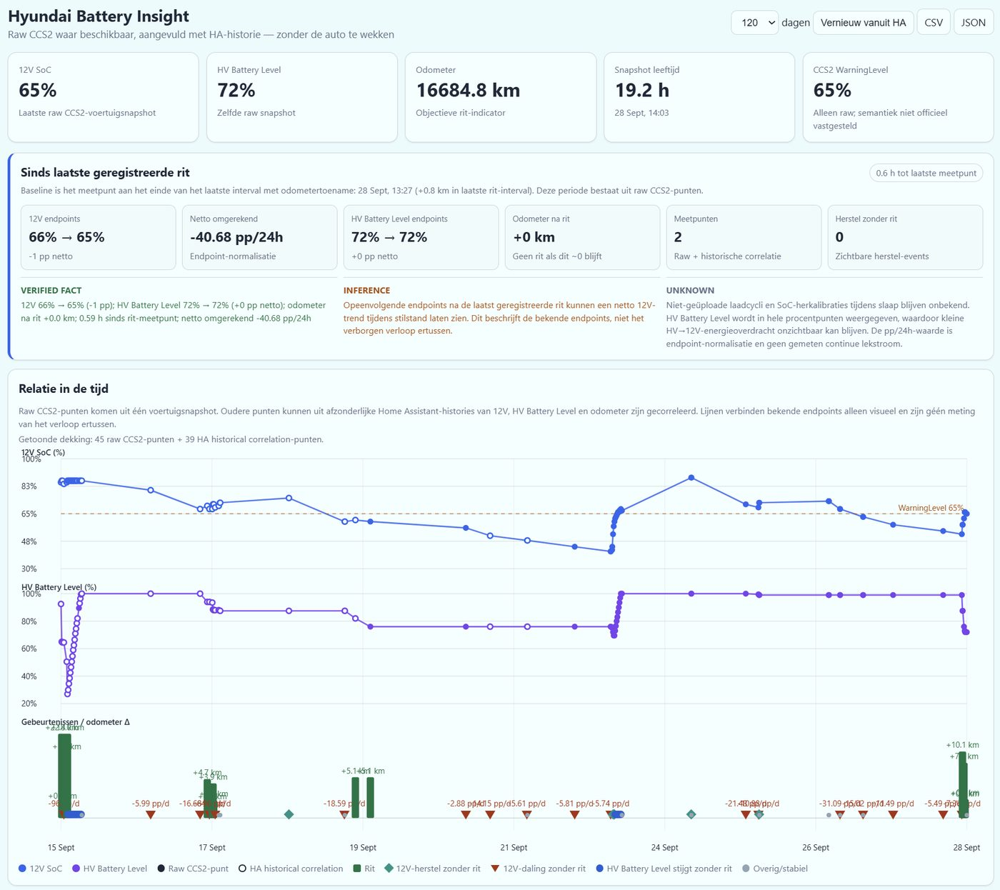
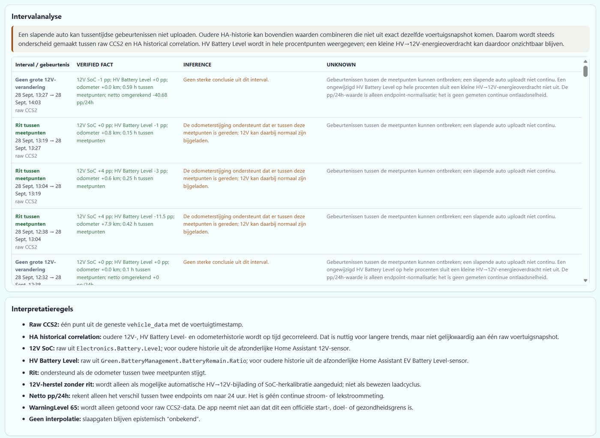

# Hyundai Battery Insight

<p align="center">
  
</p>

Local Home Assistant app that correlates Hyundai / Kia vehicle battery information already present in Home Assistant. It never calls Hyundai/Bluelink directly and does not request a vehicle refresh.

## Why I created this

I created Hyundai Battery Insight after repeatedly seeing the 12V battery in my Hyundai drain during periods when the car was used less frequently. If that drain continues for long enough, it can eventually leave the 12V battery effectively dead and the car unable to start. The individual values exposed by Hyundai / Kia Connect were useful, but looking at a single current value did not answer the questions I actually had: **when did the 12V level start dropping, was the car driven in between, did the HV battery level change, and did the 12V battery recover without a recorded trip?**

Home Assistant already had much of the data needed to investigate this, but it was spread across the raw vehicle payload, separate sensor histories and different timestamps. This app brings those sources together into one timeline.

A few design goals followed from that:

- **Do not wake the car just to collect data.** The app works with information that is already present in Home Assistant.
- **Use the vehicle timestamp where possible.** Raw CCS2 data is tied to the timestamp reported by the vehicle instead of assuming the Home Assistant update time is the measurement time.
- **Correlate 12V, HV Battery Level and odometer data.** Odometer movement provides useful context for distinguishing periods with and without driving.
- **Keep evidence quality visible.** A raw vehicle snapshot is not treated as equivalent to values reconstructed from separate Home Assistant histories.
- **Do not fill gaps with invented measurements.** If the car was asleep and no measurement exists, the interval remains unknown.
- **Separate facts from interpretation.** The dashboard deliberately distinguishes **VERIFIED FACT**, **INFERENCE** and **UNKNOWN** rather than presenting every pattern as a proven cause.

The project started as a practical diagnostic tool for understanding 12V battery drain over days and weeks, especially during longer standstill periods, and for spotting a downward trend before it ends in a deeply discharged or dead 12V battery. I published it because the same approach may be useful to other Hyundai and Kia owners who already use the Hyundai / Kia Connect integration in Home Assistant.

## Screenshots

### Overview and timeline



### Interval analysis and interpretation rules



The screenshots show example data from the development vehicle. They do not contain a VIN or licence plate.

## Tested setup and compatibility

This app was developed and tested against:

- **Hyundai Tucson PHEV, model year 2025**
- **Home Assistant OS**
- **Hyundai / Kia Connect** for Home Assistant

Other Hyundai/Kia models, model years, regions and integration versions may expose different entities or payload structures and have not necessarily been tested. The app includes entity auto-detection, but manual configuration may be required for other setups.

The current user interface is **Dutch only**. There is no built-in language selector or English translation at this time.

## Requirements

- **Home Assistant OS**. Home Assistant Apps are available on Home Assistant OS.
- **Hyundai / Kia Connect** installed and configured in Home Assistant:
  - GitHub: https://github.com/Hyundai-Kia-Connect/kia_uvo
  - The upstream project is installed through HACS; its current instructions use the name **Kia Uvo** in HACS and in **Settings → Devices & Services → Integrations**.
- A working Hyundai / Kia Connect vehicle entry exposing the battery/vehicle entities used by this app.
- Home Assistant Recorder history is required for the extended historical correlation view.

Hyundai Battery Insight reads data already available in Home Assistant. It does **not** authenticate against Hyundai/Kia itself.

## Installation

### Recommended: add this repository to Home Assistant

This repository is structured as a Home Assistant third-party App repository. For Home Assistant to fetch it directly from GitHub, this repository must be publicly accessible.

Repository URL:

```text
https://github.com/rvdheuvel72/Hyundai-Battery-Insight
```

1. In Home Assistant, go to **Settings → Apps**.
2. Select **Install app**.
3. Open the **⋮** menu in the top-right corner and select **Repositories**.
4. Paste the repository URL above and select **Add**.
5. Return to the App store.
6. Open **Hyundai Battery Insight** and select **Install**.
7. After installation, review the app configuration.
8. Start the app.
9. Open **Web UI**. Optionally enable **Show in sidebar**.

If the repository or app does not appear immediately, refresh the Home Assistant browser UI. For repository errors, check **Settings → System → Logs** and select the Supervisor log.

### Manual / local installation

You can also install the app without adding the GitHub repository.

Copy the contents of:

```text
hyundai_battery_insight/
```

from this repository to:

```text
/addons/hyundai_battery_insight
```

Using Terminal & SSH, reload the local App store:

```sh
ha store reload
```

Then go to **Settings → Apps → Install app**. The app should appear under **Local apps** as **Hyundai Battery Insight**.

## Configuration

Version 0.1.8 can auto-detect the relevant Home Assistant sensors. The app configuration also allows explicit entity IDs:

- `raw_entity`: Hyundai / Kia Connect entity containing the nested `vehicle_data` payload. Default: `sensor.tucson_data_2`.
- `aux_soc_entity`: 12V battery percentage sensor, or `auto`.
- `hv_battery_entity`: EV/HV battery level sensor, or `auto`.
- `odometer_entity`: odometer sensor, or `auto`.
- `lookback_days`: historical lookback period.
- `poll_seconds`: Home Assistant polling interval used by this app.
- `import_on_start`: import available Home Assistant history when the app starts.

The default `raw_entity` is specific to the original development vehicle. If your Hyundai / Kia Connect entity IDs differ, set the appropriate entity explicitly in the app configuration.

## Evidence model

- **Raw CCS2 points** come from one nested `vehicle_data` payload and use the CCS2 vehicle timestamp.
- **HA historical correlation points** extend the timeline with the separate Home Assistant 12V, HV Battery Level and odometer histories when older raw attributes are no longer available.
- HA historical correlation is explicitly marked as lower evidentiary quality than one raw vehicle snapshot; values can be carried from the most recent state of a separate sensor.
- Gaps while the car sleeps are never interpolated as measurements.
- Odometer movement is used as evidence that a drive occurred between points.
- A 12V rise without odometer movement is labelled only as possible automatic support/recalibration, not proven charging.
- `Electronics.Battery.Charging.WarningLevel` is displayed only when raw CCS2 data is present and is not treated as an official Aux Battery Saver threshold.

## History entities

For the original development vehicle, auto-detection is expected to find the 12V sensor by its `Car Battery` / `12V` naming, and the known EV Battery Level and Odometer sensors.

Because Hyundai / Kia Connect entity naming can differ by vehicle, account, integration version and region, verify the detected entities in your own Home Assistant installation.

## Privacy and data handling

Hyundai Battery Insight is designed to work locally with data already available in Home Assistant.

- The app reads Home Assistant data through the local Home Assistant/Supervisor API.
- It does not log in to Hyundai/Kia and does not directly call Hyundai/Bluelink services.
- Historical data collected by the app is stored locally in the app's Home Assistant data directory using SQLite.
- The complete raw vehicle payload can contain identifiers such as a VIN or licence-plate/registration value. Starting with 0.1.8, raw payloads stored in SQLite are protected with authenticated encryption using a key deterministically derived from the vehicle VIN and an app-specific derivation context.
- This protection is intentionally **recoverable rather than high-security**: a reinstall can recreate the same key from the same VIN, so preserved/restored raw records do not become unreadable because an installation-local secret was lost. Someone who knows the VIN and has the source code should not be assumed to be cryptographically excluded from the data.
- Legacy plaintext `raw_json` rows are detected and converted in place when a VIN is available. The temporary pre-release v1 format is also migrated when its old local secret is still present; unreadable rows are never deleted automatically.
- The protection key is recoverable after reinstall, but the SQLite database itself still needs to survive the reinstall or be restored from a Home Assistant backup. Version 0.1.8 uses a cold app backup to help keep SQLite backups consistent.
- The app contains no project telemetry or analytics and does not send vehicle data to an external service operated by this project.
- CSV and JSON exports are generated only when requested through the app UI and do not include the full protected raw payload.

The separate Hyundai / Kia Connect integration has its own communication and data-handling behaviour; refer to that project's documentation for details.

## Disclaimer and maintenance

Hyundai Battery Insight is provided **as-is**. It was created primarily for my own Home Assistant setup and vehicle, and while I have made it available for others who may find it useful, there are no guarantees that it will work with every Hyundai/Kia model, region, integration version or Home Assistant release.

There is **no commitment or guarantee of future updates, maintenance, bug fixes or compatibility changes**. The project may be updated when I have a need for it or when I have time to improve it, but users should not rely on a particular update schedule.

You are welcome to **fork or clone this repository and modify the app for your own needs** under the MIT License. Vehicle entities, available data and behaviour can differ between cars and Home Assistant installations, so adapting the configuration or code may be appropriate for your setup.

Use the app at your own discretion and verify important conclusions against the underlying Home Assistant and vehicle data.

## Independent project

Hyundai Battery Insight is an independent community project. It is **not affiliated with, endorsed by, or supported by Hyundai, Kia, Home Assistant, or the Hyundai / Kia Connect project**.

Product names and trademarks belong to their respective owners.

## Support and contributions

Issues and pull requests are welcome if you find a bug or want to improve compatibility with another vehicle or Home Assistant setup.

Support is best-effort only. There is no guarantee of a response, fix, feature addition or compatibility update.

## License

Hyundai Battery Insight is released under the [MIT License](LICENSE). You are free to use, fork, modify and redistribute it subject to the license terms.

For the in-app documentation and version history, see [DOCS.md](hyundai_battery_insight/DOCS.md) and [CHANGELOG.md](hyundai_battery_insight/CHANGELOG.md).

## 0.1.8

- Adds the new original **Battery Insight** icon/logo to the Home Assistant app and repository without using Hyundai/Kia brand marks in the artwork.
- Fixes the manual local-installation path to `/addons/hyundai_battery_insight`.
- Restricts the ingress-only HTTP server to requests from the Home Assistant Supervisor ingress proxy.
- Protects complete raw vehicle payloads at rest with a recoverable VIN-derived authenticated-encryption format.
- Automatically migrates legacy plaintext raw payloads on startup when a VIN is available.
- Supports migration of the temporary pre-release v1 encrypted format when its old local secret is still available.
- Makes the raw-protection key reproducible after reinstall so restored/preserved data is not tied to an installation-local random secret.
- Uses cold Home Assistant backups for safer SQLite backup consistency.
- Adds app-level README, documentation, changelog, repository metadata, security guidance and CI validation.
- Pins the Home Assistant base image to Alpine 3.24 instead of `latest`.

## 0.1.7

- Extends the timeline beyond the period where full raw `vehicle_data` attributes are available by importing the separate Home Assistant histories for 12V battery level, HV Battery Level and odometer.
- Auto-detects those three history entities, with optional explicit entity configuration.
- Keeps raw CCS2 points and reconstructed HA historical correlation points visually and analytically distinct.
- Raw points take precedence when a historical correlation point is close to the same timestamp.
- Removes the standalone **Extern laden** UI metric and the obsolete `ev_charging_entity` configuration option.
- Keeps raw charging remaining-time only as internal/export diagnostic context; it is no longer a separate visible dashboard item.
- CSV/JSON exports include `source_kind` and per-field source timestamps for historical correlation transparency.

## 0.1.6

- Stops using the Home Assistant EV-charging switch or connected/disconnected state as evidence of charging.
- Derives charging context from raw CCS2 `Green.ChargingInformation.Charging.RemainTime > 0` when available.
- Keeps `ConnectorFastening.State` only as raw diagnostic data because it has been observed to update unreliably on this vehicle.

## 0.1.5

- Renames the user-facing traction-battery value to **HV Battery Level**.
- Documents the source as `Green.BatteryManagement.BatteryRemain.Ratio`; it is a reported remaining-battery percentage, not explicitly named State of Charge by the CCS2 field.
- Renames the public JSON/CSV field from `ev_soc` to `hv_battery_level`; the legacy internal SQLite column remains unchanged for upgrade compatibility.

## 0.1.3

- Adds a dedicated **Sinds laatste geregistreerde rit** summary.
- Adds endpoint-normalized 12V change in percentage points per 24 hours.
- Classifies ride, no-ride decline, no-ride recovery, HV-level increase and stable intervals.
- Explicitly notes whole-percent HV Battery Level resolution and hidden sleep-gap uncertainty.
